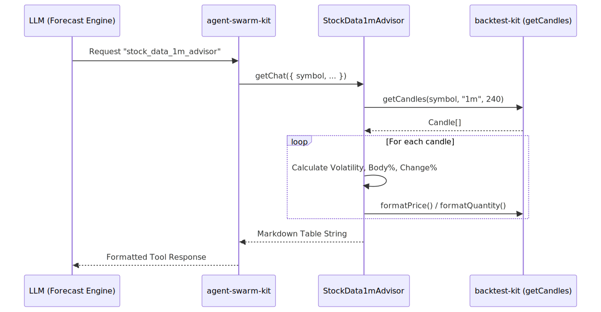

# Advisors: News & Market Data

The news-sentiment-ai-trader utilizes a set of **Advisors** to provide the LLM with the necessary context to generate market forecasts. These advisors are registered via the `agent-swarm-kit` and act as specialized data retrieval tools. They transform raw data from external APIs and internal market state into structured Markdown or JSON formats optimized for LLM consumption.

The system implements three primary advisors defined in `logic/enum/AdvisorName.ts`:
1.  **TavilyNewsAdvisor**: Retrieves filtered news and sentiment data.
2.  **StockData1mAdvisor**: Provides high-resolution 1-minute price action.
3.  **StockData15mAdvisor**: Provides medium-resolution 15-minute price action for trend analysis.

### Advisor Architecture & Data Flow

The advisors bridge the gap between the "Code Entity Space" (API calls, data processing) and the "Natural Language Space" (Markdown tables, JSON summaries).

**System Entity Mapping**
Title: Advisor Component Mapping

---

### TavilyNewsAdvisor

The `TavilyNewsAdvisor` is responsible for gathering qualitative data regarding market sentiment. It uses the `WebSearchRequestContract` which requires a `symbol` and a `resultId`.

#### Implementation Details
- **Search Logic**: It iterates through predefined `TOPIC_QUERIES`. Currently, it focuses on "sentiment" with queries targeting Bitcoin market sentiment (bullish, bearish, neutral, or sideways).
- **Deduplication**: Uses a `Map` keyed by URL to ensure that if multiple queries return the same article, it is only included once in the final output.
- **Output**: Returns a JSON string containing an array of objects with `title`, `content`, and `publishedDate`.

---

### Market Data Advisors

The market data advisors provide quantitative context. They share a similar implementation pattern but differ in their lookback windows and timeframes. Both utilize the `StockDataRequestContract`.

#### Data Resolution Comparison
| Advisor | Timeframe | Limit (Candles) | Total Duration |
| :--- | :--- | :--- | :--- |
| `StockData1mAdvisor` | 1m | 240 | 4 Hours |
| `StockData15mAdvisor` | 15m | 32 | 8 Hours |

#### StockData1mAdvisor
Registered as `stock_data_1m_advisor`, this component fetches 240 candles of 1-minute data using the `getCandles` utility from `backtest-kit`. It calculates several technical metrics for each candle to assist the LLM in understanding volatility and price action:
- **Volatility %**: `((high - low) / close) * 100`.
- **Body %**: The size of the candle body relative to its total range.
- **Change %**: The percentage difference between Open and Close.

#### StockData15mAdvisor
Registered as `stock_data_15m_advisor`, this component fetches 32 candles of 15-minute data. It uses the same formatting logic as the 1m advisor but provides a broader view of the market trend.

#### Markdown Formatting
Both advisors format their data into a Markdown table for the LLM. The table includes:
- **Time**: Formatted as `YYYY-MM-DD HH:mm UTC` using `dayjs`.
- **Price/Volume**: Formatted using `formatPrice` and `formatQuantity` to ensure correct decimal precision for the specific symbol.

---

### Implementation Sequence

The following diagram illustrates how the `agent-swarm-kit` interacts with an advisor (e.g., `StockData1mAdvisor`) to produce data for the LLM.

Title: Advisor Execution Flow
