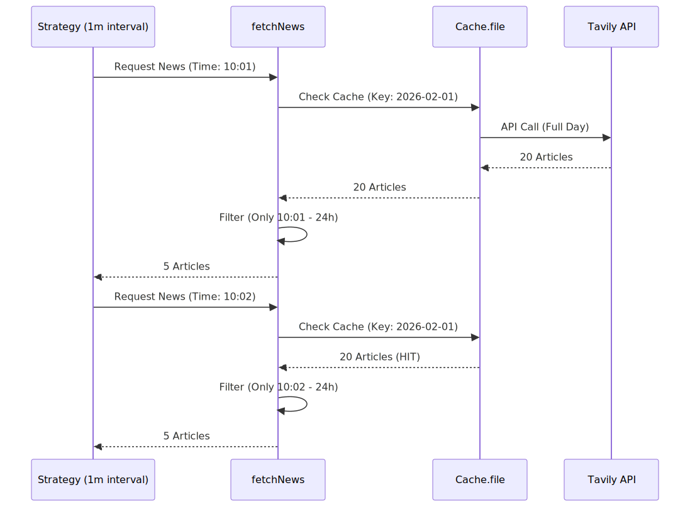

# News Fetching & Caching (fetchNews)

Relevant source files

The following files were used as context for generating this wiki page:

- [logic/api/fetchNews.ts](logic/api/fetchNews.ts)
- [logic/config/setup.ts](logic/config/setup.ts)
- [logic/config/tavily.ts](logic/config/tavily.ts)

The `fetchNews` module serves as the primary data retrieval layer for the AI forecasting engine. It abstracts the complexity of searching for financial news, managing API rate limits via caching, and enforcing strict temporal boundaries to ensure backtest integrity.

### Purpose and Scope
The module integrates with the Tavily Search API to provide high-quality, filtered news content to the LLM advisors. It is designed to handle two distinct execution modes:
1.  **Live Mode**: Real-time fetching of the most recent news.
2.  **Backtest Mode**: Deterministic retrieval of historical news with aggressive caching and look-ahead bias prevention.

---

## News Retrieval Architecture

The news fetching process is centralized in `logic/api/fetchNews.ts`. It utilizes the `Tavily` client, which is initialized as a singleton using the `TAVILY_TOKEN` environment variable.

### System Data Flow (fetchNews)

This diagram illustrates how the `fetchNews` function interacts with the `backtest-kit` state and external APIs to provide data to the forecasting logic.

"fetchNews Data Flow"

**Sources:** [logic/api/fetchNews.ts:136-163](), [logic/config/tavily.ts:4-8](), [logic/api/fetchNews.ts:91-110]()

---

## Domain Filtering & Validation

To ensure the LLM receives high-signal data, the system implements strict domain whitelisting and blacklisting.

### Allowed and Disallowed Domains
The system prioritizes crypto-native media, regulatory bodies, and specific social platforms while excluding sources that frequently omit publication timestamps.

| Category | Domains |
| :--- | :--- |
| **Crypto Media** | `cointelegraph.com`, `theblock.co`, `decrypt.co`, `blockworks.co` |
| **Regulators** | `sec.gov`, `federalreserve.gov`, `whitehouse.gov` |
| **Social/Personas** | `truthsocial.com`, `stocktwits.com` |
| **Blacklisted** | `coindesk.com`, `reuters.com`, `bloomberg.com`, `wsj.com` (Missing `publishedDate`) |

**Sources:** [logic/api/fetchNews.ts:16-38]()

### Validation Logic
The `getDomainList` function ensures that no domain exists in both lists simultaneously. Additionally, the `search` function rejects any result where the `publishedDate` is missing or defaults to `00:00` (often indicating a placeholder date).

**Sources:** [logic/api/fetchNews.ts:40-46](), [logic/api/fetchNews.ts:70-82]()

---

## Temporal Windows & Look-Ahead Bias

A critical requirement for valid backtesting is the prevention of "look-ahead bias"—using information that would not have been available at the time of the trade.

### The NEWS_WINDOW_HOURS Constraint
The system defines a global `NEWS_WINDOW_HOURS = 24`. Regardless of the mode, `fetchNews` only returns articles published within the 24-hour window ending exactly at the current system time (`getDate()`).

**Sources:** [logic/api/fetchNews.ts:14-14](), [logic/api/fetchNews.ts:142-143](), [logic/api/fetchNews.ts:157-162]()

### Mode-Specific Implementation

| Feature | `fetchNewsInLive` | `fetchNewsInBacktest` |
| :--- | :--- | :--- |
| **Time Range** | Last 48 hours (buffer for filtering) | +/- 1 day from `alignToInterval(when, "1d")` |
| **Caching** | None (always fresh) | `Cache.file` (persisted to disk) |
| **Cache Key** | N/A | `symbol_topic_alignMs_query` |
| **API Frequency** | Every call | Once per daily candle open |

**Sources:** [logic/api/fetchNews.ts:91-110](), [logic/api/fetchNews.ts:116-129]()

---

## Implementation Details

### Backtest Caching Strategy
The `fetchNewsInBacktest` function uses `Cache.file` from the `backtest-kit`. This is vital because a 1-minute backtest for one month would otherwise trigger ~43,000 API calls. By aligning the cache to `1d` (one day), the system fetches a "daily batch" of news and stores it locally.

"Backtest Cache Resolution"

**Sources:** [logic/api/fetchNews.ts:91-110](), [logic/api/fetchNews.ts:152-162]()

### Configuration & Localization
The module relies on a global `dayjs` configuration defined in `logic/config/setup.ts`, which enables UTC support and Russian locale formatting for LLM-friendly date strings.

**Sources:** [logic/config/setup.ts:1-12]()

### API Parameters
The `search` function configures the Tavily client with specific parameters:
- `topic: "news"`: Restricts search to news indices.
- `searchDepth: "advanced"`: Enables more thorough crawling.
- `maxResults: 20`: Limits the volume of data per query to maintain LLM context window limits.

**Sources:** [logic/api/fetchNews.ts:55-64]()