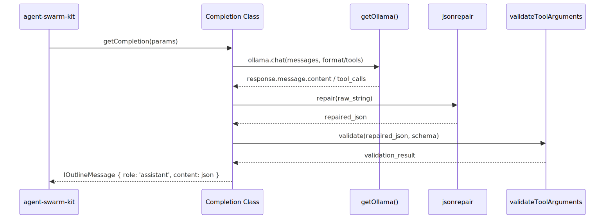

# Ollama Completions

Relevant source files

The following files were used as context for generating this wiki page:

- [logic/config/ollama.ts](logic/config/ollama.ts)
- [logic/core/completion/ollama_outline_format.completion.ts](logic/core/completion/ollama_outline_format.completion.ts)
- [logic/core/completion/ollama_outline_tool.completion.ts](logic/core/completion/ollama_outline_tool.completion.ts)
- [logic/enum/CompletionName.ts](logic/enum/CompletionName.ts)

The `news-sentiment-ai-trader` system utilizes Ollama-compatible models to perform structured sentiment analysis. The system implements two distinct completion strategies to ensure robust JSON output from LLMs: `OllamaOutlineToolCompletion` (function calling) and `OllamaOutlineFormatCompletion` (native JSON mode). Both implementations are built on top of the `agent-swarm-kit` and target the `minimax-m2.7:cloud` model.

## Model Configuration

All completions are routed through a central configuration that connects to an Ollama host.

*   **Model Name**: `minimax-m2.7:cloud` [[logic/core/completion/ollama_outline_format.completion.ts:20-20](), [logic/core/completion/ollama_outline_tool.completion.ts:19-19]()]
*   **Host**: `https://ollama.com` [[logic/config/ollama.ts:7-7]()]
*   **Authentication**: Uses the `OLLAMA_TOKEN` environment variable [[logic/config/ollama.ts:9-9]()]
*   **Singleton Pattern**: The `getOllama` function uses `singleshot` to ensure only one instance of the Ollama client is created [[logic/config/ollama.ts:4-12]()]

### Reliability Parameters
Both completion types share identical retry and timeout logic to handle network instability or model hallucinations:
*   **COMPLETION_MAX_ATTEMPTS**: 3 (Internal loop for model corrections) [[logic/core/completion/ollama_outline_format.completion.ts:13-13]()]
*   **COMPLETION_MAX_RETRIES**: 5 (External `retry` wrapper for network/timeout errors) [[logic/core/completion/ollama_outline_format.completion.ts:14-14]()]
*   **COMPLETION_RETRY_DELAY**: 5,000ms [[logic/core/completion/ollama_outline_format.completion.ts:15-15]()]
*   **COMPLETION_TIMEOUT**: 300,000ms (5 minutes) [[logic/core/completion/ollama_outline_format.completion.ts:17-17]()]

---

## Implementation Strategies

### 1. OllamaOutlineToolCompletion
This implementation forces the model to use a specific function called `provide_answer`. It is registered under the name `ollama_outline_tool_completion` [[logic/enum/CompletionName.ts:2-2]()].

**Mechanism:**
1.  **Tool Definition**: A tool of type `function` is created with the name `provide_answer`. The JSON schema for the response is passed into the `parameters` field [[logic/core/completion/ollama_outline_tool.completion.ts:34-41]()].
2.  **System Prompting**: A system message is injected at the start of the conversation, explicitly commanding the model to use the tool and forbidding plain text responses [[logic/core/completion/ollama_outline_tool.completion.ts:44-50]()].
3.  **Fallback/Correction**: If the model fails to call the tool, the system appends a user message reminding the model to use `provide_answer` and increments the attempt counter [[logic/core/completion/ollama_outline_tool.completion.ts:80-87]()].
4.  **Data Repair**: The tool arguments are processed through `jsonrepair` before parsing to fix minor syntax errors in the LLM's JSON string [[logic/core/completion/ollama_outline_tool.completion.ts:98-99]()].

### 2. OllamaOutlineFormatCompletion
This implementation uses Ollama's native structured output capability. It is registered under the name `ollama_outline_format_completion` [[logic/enum/CompletionName.ts:3-3]()].

**Mechanism:**
1.  **Schema Injection**: The JSON schema is passed directly to the `format` parameter of the `ollama.chat` call [[logic/core/completion/ollama_outline_format.completion.ts:51-51]()].
2.  **Response Handling**: The model's `message.content` is expected to be a raw JSON string.
3.  **Validation**: The parsed JSON is validated against the schema using `validateToolArguments` from `agent-swarm-kit` [[logic/core/completion/ollama_outline_format.completion.ts:68-68]()].

### Completion Logic Flow
The following diagram illustrates how `fetchCompletion` handles the request lifecycle for both implementations.

**Completion Request Lifecycle**

Sources: [logic/core/completion/ollama_outline_format.completion.ts:22-88](), [logic/core/completion/ollama_outline_tool.completion.ts:21-135]()

---

## Technical Details

### JSON Repair and Validation
Because LLMs occasionally output invalid JSON (e.g., trailing commas, missing quotes), the system uses the `jsonrepair` library. This is applied to both tool arguments and format-mode content before `JSON.parse` is invoked [[logic/core/completion/ollama_outline_format.completion.ts:64-66](), [logic/core/completion/ollama_outline_tool.completion.ts:98-99]()].

### Timeout Handling
To prevent the trading pipeline from hanging indefinitely, a `Promise.race` is used between the Ollama request and a `sleep` timer [[logic/core/completion/ollama_outline_format.completion.ts:41-55]()]. If the timer wins, a `COMPLETION_TIMEOUT_SYMBOL` is returned, triggering a retry [[logic/core/completion/ollama_outline_format.completion.ts:57-60]()].

### Data Flow: From Request to IOutlineMessage
The following diagram maps the transformation of data from the initial call to the final structured message.

**Data Transformation Pipeline**

Sources: [logic/core/completion/ollama_outline_format.completion.ts:90-97](), [logic/core/completion/ollama_outline_tool.completion.ts:137-144](), [logic/config/ollama.ts:4-12]()

### Shared Configuration Table

| Feature | `OllamaOutlineToolCompletion` | `OllamaOutlineFormatCompletion` |
| :--- | :--- | :--- |
| **Registration Name** | `ollama_outline_tool_completion` | `ollama_outline_format_completion` |
| **Model** | `minimax-m2.7:cloud` | `minimax-m2.7:cloud` |
| **Primary Method** | Function calling (`provide_answer`) | Native JSON `format` schema |
| **Internal Retries** | 3 attempts with system prompt injection | 3 attempts with schema re-validation |
| **Global Retries** | 5 retries (5s delay) | 5 retries (5s delay) |
| **Flags** | Russian Language, Reasoning: high | Russian Language, Reasoning: high |

Sources: [logic/core/completion/ollama_outline_tool.completion.ts:12-19](), [logic/core/completion/ollama_outline_format.completion.ts:13-20](), [logic/enum/CompletionName.ts:1-6]()