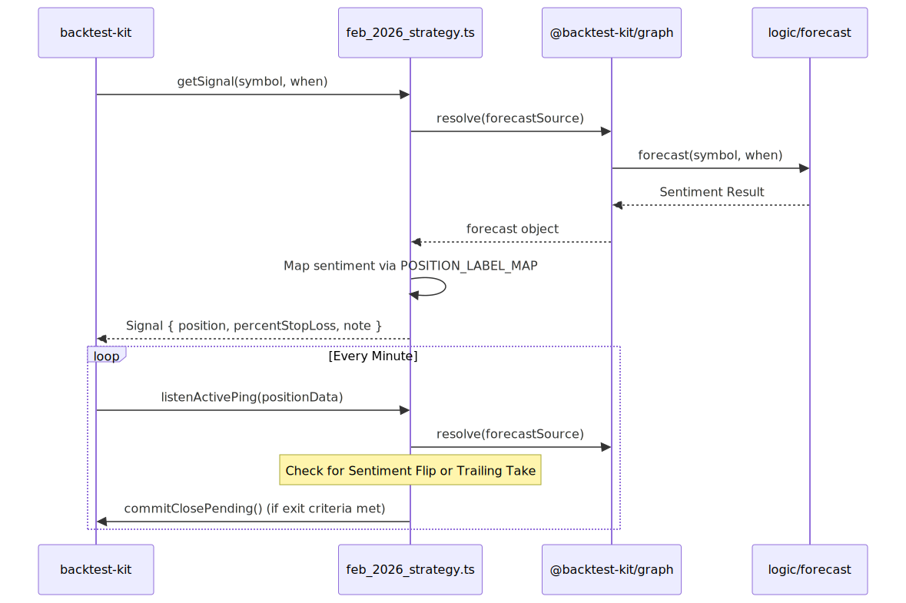

# Trading Strategy: feb_2026_strategy

The `feb_2026_strategy` is a news-driven algorithmic trading strategy designed to capitalize on market sentiment during volatile periods. It utilizes a Large Language Model (LLM) to process real-time news and market data, converting qualitative information into quantitative trade signals. This strategy was specifically backtested against the high-volatility "SaaSpocalypse" and geopolitical shifts of February 2026.

### Core Logic Overview

The strategy follows a reactive model where trade entry is dictated by AI-generated forecasts and exits are managed by a combination of fixed risk parameters and sentiment reversals.

*   **Sentiment Analysis**: Uses the `forecast` engine to categorize news as `bullish`, `bearish`, or `neutral`.
*   **Execution**: Signals are mapped to `long` or `short` positions using a strictly defined label map.
*   **Risk Control**: Implements a 3.0% hard stop-loss and a 2.5% trailing take-profit mechanism.

**Entity Mapping: Signal Flow**

The following diagram bridges the natural language concept of "News Sentiment" to the specific code entities that resolve and execute trades.

---

### Signal Generation & Sentiment Mapping
Signals are generated by resolving a graph-based data dependency. The strategy uses `sourceNode` to fetch LLM forecasts and `outputNode` to transform those forecasts into actionable trade directions. A critical component is the `NEWS_WINDOW` (24 hours), which acts as a cooldown to prevent over-trading on the same news cycle.

For details, see [Signal Generation & Sentiment Mapping](./10-signal-generation-sentiment-mapping.md).

### Position Lifecycle & Exit Logic
Once a position is opened via `Position.moonbag`, its lifecycle is monitored by `listenActivePing`. The strategy employs three primary exit triggers:
1.  **Hard Stop-Loss**: Triggered at a 3.0% price move against the position.
2.  **Trailing Take-Profit**: Activates once profit exceeds 2.5% and then retraces.
3.  **Sentiment Flip**: Closes the position immediately if a new forecast contradicts the current trade direction.

For details, see [Position Lifecycle & Exit Logic](./11-position-lifecycle-exit-logic.md).

### Backtest Module & Frame Configuration
The strategy is executed within the `feb_2026_frame`, a temporal window spanning February 1st to February 28th, 2026. It utilizes the `ccxt-exchange` module to simulate a Binance-like environment with 1-minute candle precision.

For details, see [Backtest Module & Frame Configuration](./12-backtest-module-frame-configuration.md).

### February 2026 Case Study & Performance
In testing, the strategy achieved a **+16.99% net PNL** with a **2.25 profit factor**. It successfully navigated a sustained bear market by maintaining a "Short" bias for 14 out of 16 trades, correctly identifying drivers such as the Kevin Warsh Fed nomination and global tariff announcements.

For details, see [February 2026 Case Study & Performance](./13-february-2026-case-study-performance.md).

---

### Implementation Architecture

The diagram below illustrates how the strategy interacts with the `backtest-kit` and the `logic` forecast engine.


