# Signal Generation & Sentiment Mapping

Relevant source files

The following files were used as context for generating this wiki page:

- [content/feb_2026.strategy/feb_2026.strategy.ts](content/feb_2026.strategy/feb_2026.strategy.ts)
- [content/feb_2026.strategy/feb_2026.test.ts](content/feb_2026.strategy/feb_2026.test.ts)

This page describes the implementation of signal generation within the `feb_2026_strategy`. It focuses on how the system translates high-level LLM forecasts into actionable trade signals using a graph-based data resolution pattern, sentiment mapping, and strict filtering rules.

## Sentiment to Position Mapping

The core of the strategy is the translation of natural language sentiment labels produced by the LLM into discrete trading positions. This is governed by the `POSITION_LABEL_MAP` constant.

| LLM Sentiment | Trade Position | Strategy Action |
| :--- | :--- | :--- |
| `bullish` | `long` | Open Buy position |
| `bearish` | `short` | Open Sell position |
| `neutral` | `wait` | No action / Ignore |
| `sideways` | `wait` | No action / Ignore |

This mapping ensures that only clear directional biases result in market exposure. The `wait` status acts as a safety buffer for ambiguous market conditions [content/feb_2026.strategy/feb_2026.strategy.ts:25-30]().

### Graph-Based Data Resolution

The strategy utilizes a graph-based pattern from `@backtest-kit/graph` to manage data dependencies. This separates the fetching of the forecast from the logic that determines the position.

*   **`forecastSource`**: A `sourceNode` that wraps the `forecast` function. It includes a `Cache.file` layer with a 1-day interval to prevent redundant LLM calls during backtesting [content/feb_2026.strategy/feb_2026.strategy.ts:32-41]().
*   **`positionOutput`**: An `outputNode` that depends on `forecastSource`. It applies the `POSITION_LABEL_MAP` to the sentiment returned by the LLM [content/feb_2026.strategy/feb_2026.strategy.ts:43-48]().

**Sources:** [content/feb_2026.strategy/feb_2026.strategy.ts:25-48]()

## Signal Generation Pipeline

The `getSignal` function is the entry point for the strategy logic, registered via `addStrategySchema`. It follows a sequential validation pipeline before emitting a signal.

### 1. Temporal Filtering (Cooldown)
To prevent over-trading on the same news cycle, the strategy implements a `NEWS_WINDOW` of 24 hours (1440 minutes).
*   The function `getMinutesSinceLatestSignalCreated` checks the time elapsed since the last signal for the specific symbol [content/feb_2026.strategy/feb_2026.strategy.ts:54]().
*   If the elapsed time is less than `NEWS_WINDOW`, the strategy returns `null`, effectively enforcing a cooldown period [content/feb_2026.strategy/feb_2026.strategy.ts:56-58]().

### 2. Forecast Resolution & Confidence Filtering
The strategy resolves the graph nodes to obtain the latest AI insights.
*   **Confidence Check**: If `forecast.confidence` is marked as `not_reliable`, the signal is discarded [content/feb_2026.strategy/feb_2026.strategy.ts:67-69]().
*   **Sentiment Check**: Explicit checks for `neutral` or `sideways` sentiments provide a secondary layer of protection against non-directional signals [content/feb_2026.strategy/feb_2026.strategy.ts:70-75]().

### 3. Signal Construction
If all filters pass, a signal object is returned.
*   **ID**: Generated by combining the forecast ID with a random string to ensure uniqueness [content/feb_2026.strategy/feb_2026.strategy.ts:95]().
*   **Moonbag Pattern**: Uses `Position.moonbag` to set the position side and a hard stop-loss (defined by `HARD_STOP` at 3.0%) [content/feb_2026.strategy/feb_2026.strategy.ts:96-100]().
*   **Metadata**: A formatted Markdown `note` is attached, containing the LLM's reasoning and a deep link to the news dump for auditability [content/feb_2026.strategy/feb_2026.strategy.ts:83-92]().

### Data Flow Diagram: Forecast to Signal

The following diagram illustrates the transition from the LLM's natural language output to the structured signal used by the execution engine.

Title: Signal Generation Logic Flow

**Sources:** [content/feb_2026.strategy/feb_2026.strategy.ts:50-105](), [content/feb_2026.strategy/feb_2026.test.ts:38-70]()

## Sentiment Flip Detection

The strategy does not just open positions; it actively monitors them for sentiment reversals via `listenActivePing`. This creates a dynamic link between the LLM's evolving view of the market and open trades.

1.  **Continuous Polling**: Every "ping" (tick) of the active position triggers a re-resolution of `forecastSource` and `positionOutput` [content/feb_2026.strategy/feb_2026.strategy.ts:108-109]().
2.  **Comparison**: The current LLM-suggested position is compared against the actual `data.position` of the open trade [content/feb_2026.strategy/feb_2026.strategy.ts:111]().
3.  **Flip Execution**: If the sentiment has changed (e.g., from `long` to `short` or `wait`), and the new forecast is reliable, the strategy calls `commitClosePending` to exit the position immediately [content/feb_2026.strategy/feb_2026.strategy.ts:119-131]().

### Signal State Mapping Diagram

Title: Code Entities and State Transitions

**Sources:** [content/feb_2026.strategy/feb_2026.strategy.ts:107-136]()