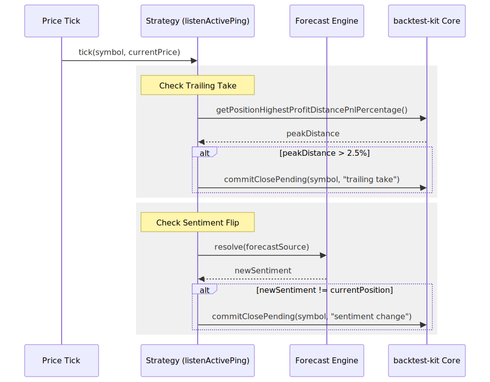

# Position Lifecycle & Exit Logic

Relevant source files

The following files were used as context for generating this wiki page:

- [content/feb_2026.strategy/feb_2026.strategy.ts](content/feb_2026.strategy/feb_2026.strategy.ts)
- [content/feb_2026.strategy/feb_2026.test.ts](content/feb_2026.strategy/feb_2026.test.ts)
- [docs/03-understanding-signals.md](docs/03-understanding-signals.md)
- [docs/diagrams/03-understanding-signals_0.svg](docs/diagrams/03-understanding-signals_0.svg)
- [docs/diagrams/03-understanding-signals_1.svg](docs/diagrams/03-understanding-signals_1.svg)

This page documents the lifecycle of trading positions within the `feb_2026_strategy`, covering the transition from signal generation to final closure. It details the three primary exit mechanisms: trailing take-profit, hard stop-loss, and sentiment-driven reversals.

## Position Initialization

Positions are initialized via the `getSignal` function within the strategy schema. The system uses a "moonbag" configuration which sets up a position with a defined stop-loss but relies on dynamic logic for profit taking.

### The Moonbag Pattern
The `Position.moonbag` utility [content/feb_2026.strategy/feb_2026.strategy.ts:96-100]() creates a signal with:
*   **Position Direction**: Derived from the `POSITION_LABEL_MAP` [content/feb_2026.strategy/feb_2026.strategy.ts:25-30]().
*   **Hard Stop-Loss**: Set by the `HARD_STOP` constant (default 3.0%) [content/feb_2026.strategy/feb_2026.strategy.ts:21]().
*   **Infinite Lifetime**: The `minuteEstimatedTime` is set to `Infinity` [content/feb_2026.strategy/feb_2026.strategy.ts:101](), meaning the position will not expire due to time and must be closed by price action or logic.

### Metadata and Notes
Every generated signal includes a `note` containing the LLM's reasoning and a link to the source news [content/feb_2026.strategy/feb_2026.strategy.ts:83-92](). This note is persisted with the trade record for auditability.

**Sources:**
* [content/feb_2026.strategy/feb_2026.strategy.ts:21-104]()

## Exit Mechanisms

The strategy monitors active positions through the `listenActivePing` hook, which executes on every price tick for currently open trades.

### 1. Sentiment Flip (ListenActivePing)
The system continuously re-evaluates the market sentiment. If the LLM forecast changes its sentiment (e.g., from `bullish` to `bearish`), the strategy triggers an immediate market close.

*   **Logic**: It resolves the current `forecastSource` and compares the new `position` recommendation against the `data.position` of the active trade [content/feb_2026.strategy/feb_2026.strategy.ts:108-113]().
*   **Execution**: If a mismatch is detected, `commitClosePending` is called [content/feb_2026.strategy/feb_2026.strategy.ts:119-131]().
*   **Safety**: If the new forecast is marked as `not_reliable`, the exit is suppressed [content/feb_2026.strategy/feb_2026.strategy.ts:115-117]().

### 2. Trailing Take-Profit
Instead of a fixed target price, the strategy uses a trailing mechanism to capture extended trends.

*   **Trigger**: The position must first be in profit (`currentProfit > 0`) [content/feb_2026.strategy/feb_2026.strategy.ts:141-143]().
*   **Threshold**: The `TRAILING_TAKE` is set to 2.5% [content/feb_2026.strategy/feb_2026.strategy.ts:20]().
*   **Mechanism**: The system calculates the distance from the highest profit peak reached during the trade's lifetime using `getPositionHighestProfitDistancePnlPercentage` [content/feb_2026.strategy/feb_2026.strategy.ts:139](). If the price retraces by more than the `TRAILING_TAKE` value from that peak, the position is closed [content/feb_2026.strategy/feb_2026.strategy.ts:144-156]().

### 3. Hard Stop-Loss
A safety net handled by the `backtest-kit` core engine.
*   **Value**: 3.0% distance from entry [content/feb_2026.strategy/feb_2026.strategy.ts:21]().
*   **Priority**: Stop-loss checks have priority over activation and other logic to ensure capital protection [docs/03-understanding-signals.md:256]().

**Sources:**
* [content/feb_2026.strategy/feb_2026.strategy.ts:107-157]()
* [docs/03-understanding-signals.md:121-134]()

## Technical Implementation Flow

The following diagram illustrates how the strategy logic interacts with the `backtest-kit` framework entities to manage the lifecycle.

### Logic to Entity Mapping
Title: Strategy Logic to Code Entity Mapping

**Sources:**
* [content/feb_2026.strategy/feb_2026.strategy.ts:52-157]()
* [docs/03-understanding-signals.md:22-30]()

## Signal State Transitions

The lifecycle follows a strict state machine managed by the framework.

| State | Description | Transition Trigger |
| :--- | :--- | :--- |
| **Idle** | Waiting for signal | `getSignal()` returns non-null |
| **Opened** | Entry triggered | Automatic next-tick transition |
| **Active** | Monitoring exits | TP, SL, or `commitClosePending` |
| **Closed** | Terminal state | Exit logic completed |

### Exit Execution Flow
Title: Position Exit Execution Flow

**Sources:**
* [content/feb_2026.strategy/feb_2026.strategy.ts:107-157]()
* [docs/03-understanding-signals.md:120-153]()

## Configuration Overrides

In specific test scenarios (e.g., `feb_2026.test.ts`), the exit logic can be modified via global configuration:
*   **CC_MAX_STOPLOSS_DISTANCE_PERCENT**: Set to 100 (effectively disabled) in some backtests to allow logic-only exits [content/feb_2026.strategy/feb_2026.test.ts:18-20]().
*   **NEVER_HARD_STOP**: A local constant used to simulate positions without stop-losses [content/feb_2026.strategy/feb_2026.test.ts:16]().

**Sources:**
* [content/feb_2026.strategy/feb_2026.test.ts:15-20]()