# Backtest Module & Frame Configuration

<details>
<summary>Relevant source files</summary>

The following files were used as context for generating this wiki page:

- [content/feb_2026.strategy/modules/backtest.module.ts](content/feb_2026.strategy/modules/backtest.module.ts)
- [docs/02-first-backtest.md](docs/02-first-backtest.md)
- [docs/diagrams/02-first-backtest_0.svg](docs/diagrams/02-first-backtest_0.svg)
- [docs/diagrams/02-first-backtest_1.svg](docs/diagrams/02-first-backtest_1.svg)

</details>


The `backtest.module.ts` file serves as the configuration bridge between the `backtest-kit` framework and the specific requirements of the February 2026 trading strategy. It defines the exchange communication protocols, historical data windows, and global framework overrides necessary for executing a high-fidelity backtest.

### Configuration Overview

The module utilizes the `backtest-kit` registry pattern to define how the system interacts with external data and how it segments time during simulation.

| Entity | Code Symbol | Purpose |
| :--- | :--- | :--- |
| **Exchange Schema** | `ccxt-exchange` | Standardizes API calls for candles, order books, and precision formatting. |
| **Frame Schema** | `feb_2026_frame` | Defines the temporal window (Feb 2026) and 1m resolution. |
| **Exchange Instance** | `getExchange` | A `singleshot` Binance singleton using CCXT. |
| **Global Override** | `CC_MAX_STOPLOSS_DISTANCE_PERCENT` | Disables framework-level stop-loss distance constraints. |

**Sources:**
- [content/feb_2026.strategy/modules/backtest.module.ts:5-7]()
- [content/feb_2026.strategy/modules/backtest.module.ts:22-23]()
- [content/feb_2026.strategy/modules/backtest.module.ts:81-82]()

---

### CCXT Exchange Integration

The system uses the `ccxt-exchange` schema to wrap the CCXT library. This allows the strategy to remain agnostic of specific exchange API quirks while benefiting from Binance's liquidity data.

#### The Binance Singleton
To prevent redundant connections and market loading, the module implements a `singleshot` (memoized) exchange getter. It configures the Binance spot market with `enableRateLimit` and time difference adjustments.

**Sources:**
- [content/feb_2026.strategy/modules/backtest.module.ts:9-20]()

#### Schema Implementation
The `addExchangeSchema` function registers four primary methods:

1.  **`getCandles`**: Fetches OHLCV data using `exchange.fetchOHLCV`. It maps the raw array response into the structured objects required by `backtest-kit`.
2.  **`getOrderBook`**: Fetches depth data. Note that this method explicitly throws an error if called during a `backtest` context to prevent unintentional real-time data leakage into historical simulations.
3.  **`formatPrice`**: Ensures prices adhere to exchange-specific tick sizes. It prefers `market.limits.price.min` or `market.precision.price` and utilizes `roundTicks` for precision.
4.  **`formatQuantity`**: Similar to price formatting, it ensures order amounts respect the `stepSize` of the specific trading pair.

**Sources:**
- [content/feb_2026.strategy/modules/backtest.module.ts:22-79]()

#### Data Flow: Exchange Schema to Framework
The following diagram illustrates how the `backtest-kit` framework consumes the registered `ccxt-exchange` schema during a simulation.

**Diagram: Exchange Schema Execution Flow**

**Sources:**
- [content/feb_2026.strategy/modules/backtest.module.ts:22-40]()
- [content/feb_2026.strategy/modules/backtest.module.ts:61-78]()
- [docs/02-first-backtest.md:18-31]()

---

### Temporal Frame Configuration

The `feb_2026_frame` defines the boundaries of the backtest. This configuration is critical for ensuring the `Backtest.run()` generator produces the correct sequence of timestamps.

*   **Interval**: `1m` (One-minute resolution).
*   **Start Date**: `2026-02-01T00:00:00Z`.
*   **End Date**: `2026-02-28T23:59:59Z`.

This frame ensures that the strategy is tested against the specific volatile period of February 2026, which includes the macro-events the LLM is trained to analyze.

**Sources:**
- [content/feb_2026.strategy/modules/backtest.module.ts:81-87]()

---

### Global Framework Overrides

The module sets specific global configurations using `setConfig`.

```typescript
setConfig({
  CC_MAX_STOPLOSS_DISTANCE_PERCENT: 100,
});
```

By setting `CC_MAX_STOPLOSS_DISTANCE_PERCENT` to `100`, the strategy disables the default safety checks that would otherwise reject signals with very wide stop-losses. This is necessary for the `feb_2026_strategy` which may utilize wide stops or rely on logic-based exits (like sentiment flips) rather than tight technical stops.

**Sources:**
- [content/feb_2026.strategy/modules/backtest.module.ts:5-7]()

---

### Code Entity Association

The following diagram maps the natural language requirements of a backtest to the specific code entities defined in the module.

**Diagram: Backtest Configuration Mapping**


**Sources:**
- [content/feb_2026.strategy/modules/backtest.module.ts:9-17]()
- [content/feb_2026.strategy/modules/backtest.module.ts:22-23]()
- [content/feb_2026.strategy/modules/backtest.module.ts:81-87]()
- [content/feb_2026.strategy/modules/backtest.module.ts:5-7]()