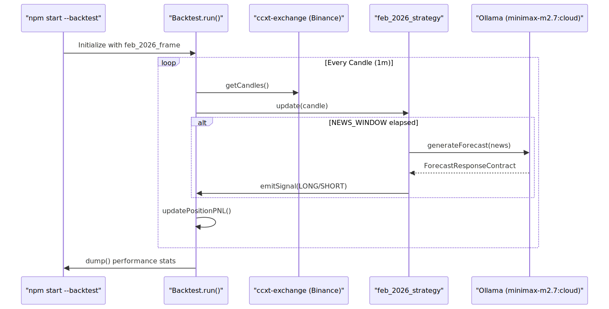

# February 2026 Case Study & Performance


This page analyzes the documented backtest results for the `feb_2026_strategy` during February 2026. The study evaluates the performance of the AI-driven sentiment engine in a high-volatility bear market characterized by significant macroeconomic shifts and geopolitical escalation.

## Case Study Overview

The February 2026 period served as a stress test for the `news-sentiment-ai-trader`. During this month, Bitcoin (BTC) experienced a net move of **−16.4%**, falling from a monthly high of ~$79,424 to a low of ~$60,000 [README.md:11-17](). The strategy utilized the `feb_2026_frame` to define the temporal window and the `ccxt-exchange` adapter for market data [README.md:3]().

### Performance Metrics

| Metric | Value |
|---|---|
| **Total Trades** | 16 |
| **Net PNL** | +16.99% |
| **Win Rate** | 68.8% (11 / 16) |
| **Profit Factor** | 2.25 |
| **Directional Bias** | 14 SHORT / 2 LONG |
| **Max Drawdown (Trade-to-Trade)** | -5.98% (Late month) |

**Sources:** [README.md:21-34](), [README.md:65-82]()

## Data Flow & Implementation

The backtest execution follows a structured pipeline where news data is retrieved, processed by the LLM, and converted into actionable trading signals.

### Signal Generation Logic
The `feb_2026_strategy` processes news every 24 hours (the `NEWS_WINDOW`) to prevent over-trading. It maps LLM sentiment labels to position directions:
*   **Bearish/Bullish:** Opens SHORT/LONG positions.
*   **Wait/Neutral:** Defers entry.

### System Data Flow: News to Trade
The following diagram illustrates how the system transitions from "Natural Language Space" (News/Reasoning) to "Code Entity Space" (Signals/Positions).

**Diagram: News-to-Execution Pipeline**

**Sources:** [README.md:5](), [README.md:38-57]()

## Key News Drivers & Market Context

The strategy's success was largely due to its ability to identify and maintain a **SHORT** bias during several high-impact fundamental shifts:

1.  **The SaaSpocalypse & AI Re-pricing:** Amazon's $200B AI capex fears and Nasdaq's 4.5% drop on Feb 7 [README.md:47]().
2.  **Fed Policy Shocks:** The nomination of Kevin Warsh and his subsequent hawkish pivot, signaling sustained high interest rates [README.md:42-44]().
3.  **Institutional Outflows:** Record Bitcoin ETF outflows totaling $4B over five weeks and MicroStrategy (MSTR) falling below cost basis [README.md:17, 43]().
4.  **Geopolitical Escalation:** US-Iran tensions and the deployment of aircraft carriers on Feb 20, which spiked the VIX above 20 [README.md:53]().
5.  **Trade Policy:** The announcement of Trump's 15% global tariffs on Feb 24 [README.md:54]().

### Allocation Model
The performance calculation uses a **non-compounding model**.
*   **Fixed Allocation:** $100 per trade.
*   **PNL Calculation:** Additive (Cumulative PNL% is the sum of individual trade PNL percentages) [README.md:63]().

## Trade Execution Analysis

The strategy utilized three primary exit mechanisms to manage risk and lock in profits.

| Exit Type | Count | Description |
|---|---|---|
| **Trailing Take-Profit** | 9 | Triggered when price retraced from peak after hitting profit thresholds. |
| **Stop-Loss** | 4 | Hard exit at 3.0% - 3.4% to protect capital. |
| **Sentiment Flip** | 3 | Immediate closure when the LLM produced a forecast opposing the current position. |

**Sources:** [README.md:32-34](), [README.md:59]()

### Notable Trades
*   **Trade #3 (Short):** The most successful trade (+14.28%). Opened Feb 4 at $75,740 following news of institutional deleveraging and a hawkish Fed pivot; closed at $64,657 [README.md:44]().
*   **Trade #11 (Long):** A successful "Sentiment Flip." The strategy correctly identified a recovery bounce on Feb 19 based on US industrial output data and the Meta-Nvidia deal [README.md:52]().

## Execution Architecture

The backtest is executed via the `Backtest.run()` engine within the `backtest-kit` framework.

**Diagram: Backtest Execution Components**

**Sources:** [README.md:89-94](), [README.md:5]()

## Running the Case Study

To replicate these results, the system must be executed with the specific strategy and frame configuration:

```bash
npm start -- --backtest --symbol BTCUSDT \
  --strategy feb_2026_strategy \
  --exchange ccxt-exchange \
  --frame feb_2026_frame \
  ./content/feb_2026.strategy/feb_2026.strategy.ts
```
**Sources:** [README.md:88-94]()