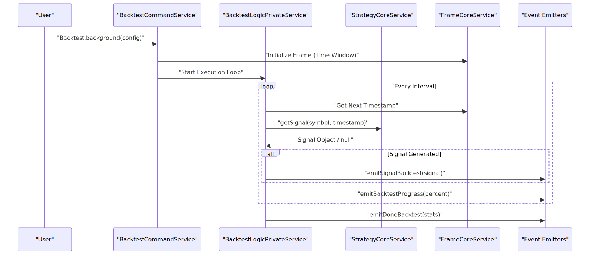

# Backtesting: Execution & Reporting

The `backtest-kit` framework provides a robust engine for historical strategy evaluation. It operates through a two-phase lifecycle: **configuration** (registering components via `add*` functions) and **execution** (running the simulation and analyzing results).

## Execution Models

The framework supports two primary execution modes: streaming and event-driven.

### 1. Streaming Generator: `Backtest.run()`
`Backtest.run()` is an asynchronous generator that yields the current timestamp at every step of the backtest. This is ideal for linear execution where the caller needs to synchronize external logic with the backtest clock.

### 2. Event-Driven: `Backtest.background()`
`Backtest.background()` executes the backtest as a background process, emitting events as it progresses. This is the preferred method for complex integrations where multiple listeners respond to signals and state changes.

#### Data Flow: Execution Logic
The following diagram illustrates the internal command flow during a background backtest execution.

**Backtest Execution Sequence**

## Event Listeners

To capture data during a background run, the framework provides specific listener functions:

| Function | Purpose | Data Provided |
| :--- | :--- | :--- |
| `listenSignalBacktest` | Triggered when a strategy generates a new signal. | `Signal` object |
| `listenBacktestProgress` | Reports the completion percentage of the current run. | `number` (0-100) |
| `listenDoneBacktest` | Triggered upon completion of the frame window. | Final statistics object |

## Statistics & Reporting

The `Backtest` singleton provides methods to retrieve performance metrics after or during execution.

### Key Metrics (`Backtest.getData()`)
The `getData()` method returns a structured object containing the strategy's performance:

*   **Total PNL**: The cumulative profit and loss across all trades.
*   **Win Rate**: Percentage of trades that closed with a positive PNL.
*   **Sharpe Ratio**: Risk-adjusted return metric.
*   **Max Drawdown**: The largest peak-to-trough decline in equity.

### Reporting and Persistence
*   **`Backtest.getReport()`**: Generates a formatted Markdown report of the backtest results.
*   **`Backtest.dump()`**: Persists the entire backtest state, including all signals and metrics, to a JSON file for later analysis.

**Reporting Component Association**

## Look-Ahead Bias Prevention

A critical feature of the `backtest-kit` is the prevention of look-ahead bias. This is achieved through "Context-Aware Data Fetching".

When a strategy calls `getCandles()` or `fetchNews()`, the framework automatically detects the execution context (Backtest vs. Live) using internal async hooks:
1.  **Timestamp Masking**: The strategy only receives data older than or equal to the "current" backtest timestamp.
2.  **News Filtering**: In the `feb_2026_strategy`, news fetching is constrained to a 24-hour window relative to the simulated time, ensuring the LLM cannot "see" future events.
