# Signal State Machine

Relevant source files

The following files were used as context for generating this wiki page:

- [docs/03-understanding-signals.md](docs/03-understanding-signals.md)
- [docs/diagrams/03-understanding-signals_2.svg](docs/diagrams/03-understanding-signals_2.svg)
- [docs/diagrams/03-understanding-signals_3.svg](docs/diagrams/03-understanding-signals_3.svg)

The Signal State Machine is the core execution logic of the `backtest-kit` framework. It governs the lifecycle of a trading instruction from its initial generation by a strategy to its final settlement. The state machine ensures logical consistency, prevents overlapping trades for the same symbol-strategy pair, and handles precise PNL calculations including slippage and exchange fees [docs/03-understanding-signals.md:6-28]().

## Signal Lifecycle & Transitions

A signal progresses through six distinct states. Transitions are strictly controlled to maintain the integrity of the trading simulation and live execution [docs/03-understanding-signals.md:24-28]().

### State Transition Diagram
The following diagram illustrates the flow between states and the triggers for each transition.

Title: Signal State Transitions

Sources: [docs/03-understanding-signals.md:26-30]()

## State Definitions

### 1. Idle
The baseline state where no active signal exists for a specific symbol-strategy pair. The framework calls the strategy's `getSignal()` function during this state [docs/03-understanding-signals.md:34-42]().

### 2. Scheduled
A pending state where a signal waits for the market price to reach a specific `priceOpen` (limit order behavior) [docs/03-understanding-signals.md:57-61]().
*   **LONG**: Activates when `currentPrice <= priceOpen`.
*   **SHORT**: Activates when `currentPrice >= priceOpen`.
*   **Expiry**: If not reached within `CC_SCHEDULE_AWAIT_MINUTES` (default 60), it transitions to `CANCELLED` [docs/03-understanding-signals.md:81-84, 224-225]().

### 3. Opened
An intermediate state triggered the moment entry conditions are met. It serves as a hook for logging and notifications before the position becomes "Active" for monitoring [docs/03-understanding-signals.md:87-94]().

### 4. Active
The position is live and being monitored for exit conditions every tick [docs/03-understanding-signals.md:119-122]().
*   **Take-Profit (TP)**: `currentPrice >= priceTakeProfit` (Long) or `<= priceTakeProfit` (Short).
*   **Stop-Loss (SL)**: `currentPrice <= priceStopLoss` (Long) or `>= priceStopLoss` (Short).
*   **Time Expiry**: Triggered if `currentTime - pendingAt > minuteEstimatedTime` [docs/03-understanding-signals.md:125-133]().

### 5. Closed
A terminal state reached after an exit condition is met. The framework calculates the final PNL at this stage [docs/03-understanding-signals.md:153-161]().

### 6. Cancelled
A terminal state for `SCHEDULED` signals that failed to trigger because the price hit the Stop-Loss first or the entry timeout expired [docs/03-understanding-signals.md:218-226]().

Sources: [docs/03-understanding-signals.md:32-246]()

## PNL Calculation with Slippage and Fees

The state machine calculates PNL by adjusting raw entry and exit prices to account for market impact (slippage) and exchange commissions [docs/03-understanding-signals.md:183-195]().

| Parameter | Default Value | Description |
| :--- | :--- | :--- |
| `CC_PERCENT_SLIPPAGE` | 0.1% | Market impact for entry/exit |
| `CC_PERCENT_FEE` | 0.1% | Exchange trading commission |

**Calculation Logic (Long Position):**
1.  **Adjusted Entry**: `priceOpen * (1 + slippage) * (1 + fee)` [docs/03-understanding-signals.md:188]()
2.  **Adjusted Exit**: `priceClose * (1 - slippage) * (1 - fee)` [docs/03-understanding-signals.md:191]()
3.  **Final PNL %**: `((Adjusted Exit - Adjusted Entry) / Adjusted Entry) * 100` [docs/03-understanding-signals.md:194]()

Sources: [docs/03-understanding-signals.md:183-215]()

## Validation Engine

Before a signal can transition from `IDLE` to `SCHEDULED` or `OPENED`, it must pass a multi-stage validation engine to ensure logical consistency and risk compliance.

### Logical Consistency & Economic Viability
The system validates that the signal parameters make sense relative to the current market price [docs/03-understanding-signals.md:265-275]().

Title: Signal Validation Logic (Code Entity Space)

**Validation Rules:**
*   **Logical Consistency**: For a LONG, `priceTakeProfit` must be > `priceOpen`, and `priceStopLoss` must be < `priceOpen` [docs/03-understanding-signals.md:275-285]().
*   **Economic Viability**: The distance between `priceOpen` and `priceTakeProfit` must be greater than the total trading costs (~0.4%) to ensure the trade can actually result in a net profit [docs/03-understanding-signals.md:310-320]().
*   **Risk Mitigation**: Checks against `maxConcurrentPositions` and symbol-specific blacklists via the `addRisk()` registry [docs/03-understanding-signals.md:330-340]().

Sources: [docs/03-understanding-signals.md:260-345]()

## Time Expiry Mechanism (`minuteEstimatedTime`)

The `minuteEstimatedTime` parameter acts as a "time-based stop-loss." It prevents capital from being locked in stagnant trades [docs/03-understanding-signals.md:128, 160]().

*   **Mechanism**: When a signal transitions to `OPENED`, a `pendingAt` timestamp is recorded.
*   **Calculation**: In every `ACTIVE` tick, the engine checks:
    `isExpired = (currentTimestamp - pendingAt) > (minuteEstimatedTime * 60 * 1000)`
*   **Result**: If `true`, the position is closed with the reason `"time_expired"`, and the PNL is settled at the current market price [docs/03-understanding-signals.md:160, 168]().

Sources: [docs/03-understanding-signals.md:128-168]()