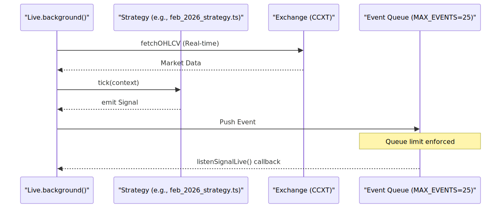

# Live Trading Mode

The Live Trading mode in the `backtest-kit` framework enables continuous strategy execution against real-time market data. Unlike backtesting, which iterates through historical data frames, Live mode operates in an infinite loop, managing the complete signal lifecycle with integrated crash recovery and persistence mechanisms.

## Execution Model: Live.background()

The primary entry point for non-blocking live execution is `Live.background()`. This function initializes the trading environment and starts an asynchronous process that monitors market conditions and manages positions.

### The Infinite Loop and Pacing
Live trading is governed by a `while(true)` loop within the `Live.run()` generator, which `Live.background()` consumes. To prevent overwhelming the exchange API and CPU, the system implements a pacing mechanism:
*   **TICK_TTL**: The system enforces a minimum wait time between iterations, typically 1 minute + 1ms.
*   **Time Progression**: Uses the system clock (`new Date()`) for every tick.
*   **MAX_EVENTS**: The event queue is capped at 25 events to ensure stability and prevent memory leaks during high-volatility periods.

### Background Data Flow
The following diagram illustrates the relationship between the `Live` process and the strategy execution components.

**Live Execution and Signal Flow**

## Crash Recovery and Persistence

Live trading is designed to be resilient against process crashes. It uses a suite of persistence adapters to save the state of active signals and schedules to the filesystem.

### Persistence Directories
Data is stored in two primary directories within the project root:
*   `data/signals/`: Stores the current state of `opened` and `active` signals.
*   `data/risk/`: Stores risk-related metadata and validation states.

### Persistence Adapters
The system utilizes specific adapters to handle different stages of the signal lifecycle:
1.  **PersistScheduleAdapter**: Tracks signals that are `scheduled` but not yet triggered.
2.  **PersistSignalAdapter**: Manages the state for signals in `opened` or `active` states.
3.  **PersistPartialAdapter**: Handles incremental updates to signal metadata.

### Atomic Write Implementation
To prevent data corruption during a crash, the persistence layer uses an atomic write strategy:
1.  Serialize the signal state to JSON.
2.  Write to a temporary file (e.g., `*.json.tmp`).
3.  Perform an atomic rename to the final filename.

**Crash Recovery State Mapping**
| Signal State | Persisted? | Adapter Class |
| :--- | :--- | :--- |
| `idle` | No | N/A |
| `scheduled` | Yes | `PersistScheduleAdapter` |
| `opened` | Yes | `PersistSignalAdapter` |
| `active` | Yes | `PersistSignalAdapter` |
| `closed` | No | N/A (Finalized) |

## Live vs. Backtest Comparison

The technical implementation of Live mode differs significantly from Backtest mode to accommodate real-world constraints.

| Characteristic | Live Mode | Backtest Mode |
| :--- | :--- | :--- |
| **Loop Type** | Infinite `while(true)` | Finite `for` loop over frames |
| **Clock** | `new Date()` (Real-time) | Simulated `Date` from Frame Service |
| **Queue Limit** | `MAX_EVENTS = 25` | Unlimited |
| **Pacing** | `TICK_TTL` (1 min delay) | Immediate (No delay) |
| **Persistence** | Enabled (Atomic FS writes) | Disabled (In-memory only) |

## System Integration: Natural Language to Code Entities

The live trading environment bridges high-level trading concepts with specific code entities and filesystem locations.

**Entity Relationship Diagram**

## Implementation Details

### Signal State Transitions
In Live mode, signals are processed through a state machine. The `tick()` function is the primary driver, checking if `scheduled` signals should move to `opened`, or if `active` positions should be `closed` based on real-time price updates or strategy logic.

### Exchange Configuration
Live trading requires `enableRateLimit: true` in the CCXT configuration to prevent IP bans. Furthermore, `formatPrice` and `formatQuantity` must use exchange-specific precision (`priceToPrecision`, `amountToPrecision`) to ensure orders are accepted by the exchange matching engine.
