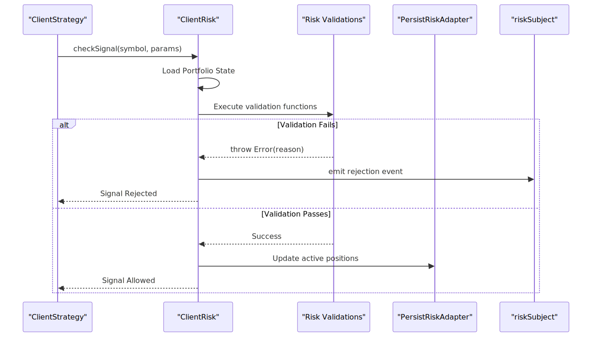

# Risk Management

<details>
<summary>Relevant source files</summary>

The following files were used as context for generating this wiki page:

- [docs/05-risk-management.md](docs/05-risk-management.md)
- [docs/diagrams/05-risk-management_0.svg](docs/diagrams/05-risk-management_0.svg)
- [docs/diagrams/05-risk-management_1.svg](docs/diagrams/05-risk-management_1.svg)

</details>


The risk management system in `backtest-kit` provides portfolio-level validation and position tracking to prevent excessive risk exposure. Unlike individual signal validation, which checks internal parameters, risk management analyzes the state of the entire portfolio across all active strategies before a signal is permitted to execute [docs/05-risk-management.md:8-12]().

## Risk Management Architecture

Risk management operates as a gatekeeper between the strategy's request for a signal and the actual creation of that signal. It ensures that any new position adheres to global constraints defined in a risk profile [docs/05-risk-management.md:31-38]().

### Execution Flow
1.  **Request**: A strategy calls `getSignal()` to generate a new trading signal [docs/05-risk-management.md:33]().
2.  **Check**: `ClientRisk.checkSignal()` evaluates the signal against registered risk rules [docs/05-risk-management.md:34]().
3.  **Validation**: Each validation function receives an `IRiskValidationPayload` containing the current portfolio state [docs/05-risk-management.md:35]().
4.  **Decision**: If any validation throws an error, the signal is **rejected**. Otherwise, it is created [docs/05-risk-management.md:36-38]().
5.  **Persistence**: Position tracking is updated and saved via `PersistRiskAdapter` to ensure crash safety [docs/05-risk-management.md:22]().

### Risk Management Component Interaction
The following diagram illustrates how the `ClientRisk` entity coordinates between strategies and validation logic.

**Risk Logic Sequence**

Sources: [docs/05-risk-management.md:27-38](), [docs/diagrams/05-risk-management_1.svg:1-15]()

## Registering Risk Profiles

Risk profiles are registered using the `addRisk()` function. Strategies link to these profiles by matching the `riskName` identifier [docs/05-risk-management.md:44-50]().

```typescript
import { addRisk } from "backtest-kit";

addRisk({
  riskName: "conservative",          // Unique identifier
  note: "Conservative profile",      // Optional documentation
  validations: [                     // Array of validation rules
    // Validation logic here
  ],
  callbacks: {                       // Optional event hooks
    onRejected: (symbol, params) => { /* ... */ },
    onAllowed: (symbol, params) => { /* ... */ },
  },
});
```
Sources: [docs/05-risk-management.md:44-64]()

### Risk Profile Schema
| Field | Type | Description |
| :--- | :--- | :--- |
| `riskName` | `string` | Unique profile identifier used by strategies [docs/05-risk-management.md:70]() |
| `note` | `string?` | Optional documentation for the profile [docs/05-risk-management.md:71]() |
| `validations` | `Array` | Array of functions or objects containing validation logic [docs/05-risk-management.md:72]() |
| `callbacks` | `object?` | Event callbacks for `onRejected` and `onAllowed` [docs/05-risk-management.md:73]() |

## IRiskValidationPayload

Every validation function receives an `IRiskValidationPayload` object. This provides the "World View" necessary for portfolio-level decision making [docs/05-risk-management.md:77-79]().

| Field | Type | Description |
| :--- | :--- | :--- |
| `symbol` | `string` | The trading pair being requested [docs/05-risk-management.md:83]() |
| `pendingSignal` | `ISignalDto` | The signal data awaiting validation [docs/05-risk-management.md:84]() |
| `strategyName` | `string` | The strategy requesting the signal [docs/05-risk-management.md:85]() |
| `activePositionCount`| `number` | Total active positions across all strategies [docs/05-risk-management.md:89]() |
| `activePositions` | `Array` | List of `IRiskActivePosition` objects currently open [docs/05-risk-management.md:90]() |
| `timestamp` | `number` | Current system/backtest timestamp in ms [docs/05-risk-management.md:88]() |

Sources: [docs/05-risk-management.md:77-101]()

## Built-in & Custom Validators

The system supports diverse validation logic, ranging from simple count limits to complex temporal and multi-strategy checks.

### 1. Concurrent Position Limits
Limits the total number of open positions to manage capital exposure [docs/05-risk-management.md:123]().
```typescript
({ activePositionCount }) => {
  if (activePositionCount >= 3) {
    throw new Error("Maximum 3 concurrent positions reached");
  }
}
```
Sources: [docs/05-risk-management.md:113-119]()

### 2. Symbol Filtering
Prevents trading on specific instruments (e.g., blacklisting high-volatility assets) [docs/05-risk-management.md:144]().
```typescript
({ symbol }) => {
  const restricted = ["DOGEUSDT", "PEPEUSDT"];
  if (restricted.includes(symbol)) {
    throw new Error(`Symbol ${symbol} is restricted`);
  }
}
```
Sources: [docs/05-risk-management.md:133-140]()

### 3. Trading Time Windows
Restricts activity to specific hours or days (e.g., avoiding weekend gaps or illiquid hours) [docs/05-risk-management.md:173]().
```typescript
({ timestamp }) => {
  const hour = new Date(timestamp).getUTCHours();
  if (hour < 9 || hour >= 17) {
    throw new Error("Outside of business hours (9:00-17:00 UTC)");
  }
}
```
Sources: [docs/05-risk-management.md:154-162]()

### 4. Multi-Strategy Coordination
Ensures strategies do not "fight" over the same symbol or exceed per-strategy quotas [docs/05-risk-management.md:208]().
```typescript
({ activePositions, strategyName, symbol }) => {
  // Check if this symbol is already being traded by ANY strategy
  const duplicate = activePositions.find(p => p.signal.symbol === symbol);
  if (duplicate) {
    throw new Error(`${symbol} already has a position via ${duplicate.strategyName}`);
  }
}
```
Sources: [docs/05-risk-management.md:183-205]()

## Rejection Events (`riskSubject`)

When a signal is rejected by the risk layer, an event is emitted to the `riskSubject` [docs/05-risk-management.md:37](). This allows UI components or monitoring logs to display the specific reason for the trade failure without the strategy needing to handle the error internally [docs/05-risk-management.md:23]().

**Entity Mapping: Code to Logic**

Sources: [docs/05-risk-management.md:31-38](), [docs/diagrams/05-risk-management_0.svg:1-10]()