# AI Strategy Optimization & Walker

The AI Strategy Optimization system is a meta-level framework within `backtest-kit` designed to automate the creation and evaluation of trading strategies. Unlike standard execution modes, the **Optimizer** uses Large Language Models (LLMs) via Ollama to synthesize executable strategy code (`.mjs` files) based on historical data and natural language prompts [docs/06-ai-optimization.md:10-12](). The **Walker** component then facilitates the multi-strategy comparison of these generated assets to identify the most robust performers.

## Optimizer Meta-System

The Optimizer functions as a code generation pipeline. It collects data from defined sources (News, Technical Indicators, etc.), formats them into LLM prompts, and processes the AI's response into a functional trading strategy [docs/06-ai-optimization.md:82-84]().

### Configuration & Registration
Optimizers are registered using the `addOptimizer` function. This requires defining training ranges (where the LLM "learns" patterns) and testing ranges (where the generated code is validated) [docs/06-ai-optimization.md:93-115]().

### Data Sources (`source`)
Data sources are the bridge between raw market information and the LLM's context. Each source must implement:
*   **fetch**: An async function to retrieve raw data (e.g., via APIs or CCXT) [docs/06-ai-optimization.md:157-177]().
*   **user**: Formats the fetched data into a string for the LLM's "user" message [docs/06-ai-optimization.md:180-187]().
*   **assistant**: (Optional) Provides a pre-analyzed summary to guide the LLM's reasoning [docs/06-ai-optimization.md:190-197]().

### Prompt Generation (`getPrompt`)
The `getPrompt` function assembles the final instructions for the LLM. It typically instructs the model to produce a strategy that follows specific risk parameters or logic structures [docs/06-ai-optimization.md:123-125]().

**Sources:** [docs/06-ai-optimization.md:90-205](), [docs/06-ai-optimization.md:208-266]()

---

## Strategy Code Generation

The system generates fully executable `.mjs` files. These files often utilize structured JSON output to ensure the strategy can be parsed by the `backtest-kit` engine.

### Structured Output Schema
To ensure the generated AI logic is actionable, the system enforces a JSON schema via Ollama's `format` parameter.

| Property | Type | Description |
| :--- | :--- | :--- |
| `position` | enum | "wait", "long", or "short" [docs/07-llm-trading.md:115-119]() |
| `priceOpen` | number | Entry price (market or limit) [docs/07-llm-trading.md:124-127]() |
| `priceTakeProfit` | number | Target exit price [docs/07-llm-trading.md:128-131]() |
| `priceStopLoss` | number | Risk exit price [docs/07-llm-trading.md:132-135]() |
| `minuteEstimatedTime`| number | Expected duration (max 360m) [docs/07-llm-trading.md:136-139]() |

### From Logic to Code
The following diagram illustrates how the Optimizer converts high-level trading concepts into internal code entities.

**Diagram: Optimizer Entity Mapping**

**Sources:** [docs/06-ai-optimization.md:93-127](), [docs/07-llm-trading.md:72-157](), [modules/walker.module.ts:18-19]()

---

## Walker & Exchange Schema

The **Walker** is the comparison engine. It executes multiple strategies (often those generated by the Optimizer) against the same market data to compare performance metrics like Sharpe Ratio and Win Rate.

### Exchange Schema (`ccxt-exchange`)
For the Walker to function across different symbols and intervals, it relies on the `ccxt-exchange` schema defined in `modules/walker.module.ts`. This schema provides a standardized interface for the underlying Binance exchange via the `ccxt` library [modules/walker.module.ts:1-16]().

Key functions in `modules/walker.module.ts`:
*   `getCandles`: Fetches OHLCV data and maps it to the internal `backtest-kit` format [modules/walker.module.ts:20-36]().
*   `getOrderBook`: Retrieves bid/ask data (Note: Throws error in backtest mode to prevent look-ahead bias) [modules/walker.module.ts:37-56]().
*   `formatPrice` / `formatQuantity`: Uses `market.limits` and `roundTicks` to ensure orders meet exchange precision requirements [modules/walker.module.ts:57-74]().

### Multi-Timeframe Analysis
Generated strategies often implement a "Waterfall" analysis pattern, where the LLM is prompted to analyze 1h, 15m, 5m, and 1m candles sequentially before generating a final signal [docs/07-llm-trading.md:169-234]().

**Diagram: Walker Execution Flow**

**Sources:** [modules/walker.module.ts:18-75](), [docs/07-llm-trading.md:169-244]()

---

## Infrastructure Requirements

### Ollama Integration
The system requires an active Ollama instance. Recommended models include `deepseek-v3.1` for its ability to handle complex trading logic and structured JSON [docs/06-ai-optimization.md:55-56]().

**Environment Configuration:**
*   `OLLAMA_HOST`: Defaults to `http://localhost:11434` [docs/06-ai-optimization.md:76-78]().
*   `OLLAMA_MODEL`: Specifies the target model for generation [docs/07-llm-trading.md:59-60]().

**Sources:** [docs/06-ai-optimization.md:24-78](), [docs/07-llm-trading.md:30-64]()