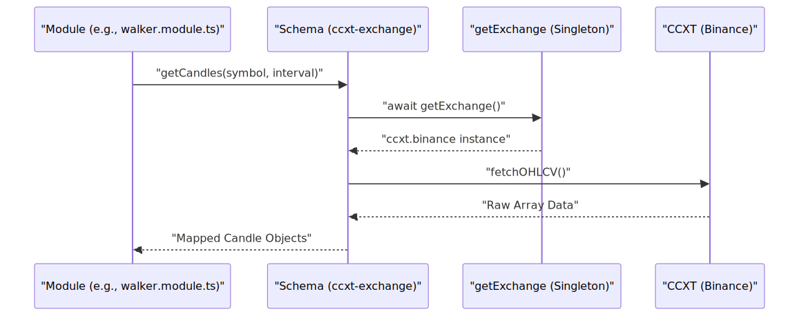

# Exchange Integration & Modules

The **Exchange Integration & Modules** layer provides the connective tissue between the high-level trading strategies and the low-level market data providers. This system relies on a standardized adapter pattern to ensure that data fetching, price formatting, and order book retrieval remain consistent whether the system is running in a live environment or a simulated backtest.

The primary mechanism for this integration is the `ccxt-exchange` schema, which is registered across multiple utility modules to support diverse tasks such as data dumping, strategy "walking," and signal generation.

### High-Level Architecture

The integration layer abstracts the complexities of the CCXT library into a unified interface used by the `backtest-kit` framework.

#### System Entity Mapping
The following diagram illustrates how the abstract "Exchange Schema" in the logic space maps to concrete CCXT implementations and singleton instances in the code.

**Diagram: Exchange Schema to Code Entity Mapping**

**Sources:** [modules/walker.module.ts:1-19](), [modules/dump.module.ts:1-18]()

---

### CCXT Exchange Adapter
The core of the exchange integration is the `ccxt-exchange` schema. It provides a standardized way to interact with the Binance spot market using the CCXT library. To prevent redundant API connections and rate-limit exhaustion, the system uses a `singleshot` singleton pattern to initialize the Binance exchange instance.

Key capabilities provided by this adapter include:
*   **OHLCV Fetching**: Mapping `fetchOHLCV` results to the internal candle format used by strategies [modules/walker.module.ts:20-36]().
*   **Order Book Retrieval**: Fetching depth data for live trading, with a safety guard that prevents usage during backtests [modules/walker.module.ts:37-56]().
*   **Precision Management**: Using `tickSize` and `stepSize` from market metadata to format prices and quantities correctly via `roundTicks` [modules/walker.module.ts:57-74]().

For details, see [CCXT Exchange Adapter](./21-ccxt-exchange-adapter.md).

**Sources:** [modules/walker.module.ts:5-16](), [modules/walker.module.ts:19-75]()

---

### Shared Utility Modules
The system utilizes several "module" files that register the exchange schema into different execution contexts. This allows different scripts (like the data dumper or the strategy optimizer) to share the same exchange logic.

| Module File | Purpose | Key Functionality |
| :--- | :--- | :--- |
| `modules/dump.module.ts` | Data Export | Registers `ccxt-exchange` for fetching historical candles to local storage [modules/dump.module.ts:18-37](). |
| `modules/pine.module.ts` | Indicator Analysis | Provides exchange access for scripts generating TradingView-compatible data [modules/pine.module.ts:18-37](). |
| `modules/walker.module.ts` | Strategy Optimization | Full implementation including `getOrderBook` and `formatPrice` for strategy evaluation [modules/walker.module.ts:18-75](). |

**Sources:** [modules/dump.module.ts:1-37](), [modules/pine.module.ts:1-37](), [modules/walker.module.ts:1-75]()

---

### Symbol Configuration
While the exchange adapter handles *how* to talk to the market, the symbol configuration defines *what* markets are available. This configuration governs the priority, visual representation (icons/colors), and metadata for every trading pair supported by the AI trader.

The configuration categorizes symbols into priority tiers (e.g., Premium 50 vs. Low 300) which influences how often or how deeply the AI analyzes specific assets.

For details, see [Symbol Configuration](./22-symbol-configuration.md).

---

### Data Flow Overview
The following diagram shows how a request for market data flows from a generic module through the CCXT adapter to the physical exchange.

**Diagram: Market Data Flow**

**Sources:** [modules/walker.module.ts:5-16](), [modules/walker.module.ts:20-35]()