# CCXT Exchange Adapter

The CCXT Exchange Adapter provides a standardized interface between the `backtest-kit` framework and the CCXT library, specifically configured for Binance. It implements a reusable `ccxt-exchange` schema that handles market data retrieval, order book fetching, and precision formatting for prices and quantities. This adapter is shared across data dumping, strategy optimization, and forecast testing modules.

### Singleton Exchange Initialization

To prevent redundant network connections and repeated market loading, the adapter utilizes a `singleshot` singleton pattern to initialize the Binance exchange instance.

| Feature | Configuration | File Reference |
| :--- | :--- | :--- |
| **Exchange** | `ccxt.binance` | |
| **Market Type** | `spot` | |
| **Time Sync** | `adjustForTimeDifference: true` | |
| **Rate Limiting** | `enableRateLimit: true` | |

The `getExchange` function ensures that `exchange.loadMarkets()` is called exactly once before any trading or data fetching operations occur.

### Exchange Schema Implementation

The adapter is registered using `addExchangeSchema`, defining how the system interacts with the physical exchange.

#### OHLCV Data Mapping
The `getCandles` function maps CCXT's `fetchOHLCV` output (an array of arrays) into the structured object format required by the `backtest-kit` engine.

#### Order Book with Backtest Guard
The `getOrderBook` implementation includes a safety check to prevent execution during backtests, as historical order book data is not supported in the default schema. In live contexts, it fetches and formats asks and bids as string-based price/quantity pairs.

#### Precision and Tick Formatting
To ensure orders are accepted by the exchange, the adapter provides `formatPrice` and `formatQuantity`. These functions retrieve `tickSize` and `stepSize` from the market metadata.
- **Priority 1:** Uses `market.limits` or `market.precision` to find the minimum increment.
- **Priority 2:** Applies `roundTicks` to align the value with the exchange's required increments.
- **Fallback:** Uses CCXT's built-in `priceToPrecision` or `amountToPrecision` methods.

### Code Entity Mapping: Exchange Integration

This diagram maps the natural language requirements of exchange interaction to the specific code entities and CCXT methods used in the implementation.

**Exchange Data Flow**

### Usage in Forecast Testing

The `run_forecast.ts` script utilizes the `ccxt-exchange` schema within a `runInMockContext` wrapper. This allows developers to test the LLM's forecasting logic against real-world historical data by mocking the execution environment (symbol and timestamp) while providing the actual exchange adapter for data resolution.

**Forecast Mock Context Flow**

### Implementation Summary Table

| Module | Schema Role | Key Functions |
| :--- | :--- | :--- |
| `dump.module.ts` | Data Extraction | `getCandles` |
| `walker.module.ts` | Strategy Optimization | `getCandles`, `getOrderBook`, `formatPrice`, `formatQuantity` |
| `pine.module.ts` | Signal Generation | `getCandles` |
| `run_forecast.ts` | Logic Validation | `getCandles`, `formatPrice`, `formatQuantity` |
