# Symbol Configuration

<details>
<summary>Relevant source files</summary>

The following files were used as context for generating this wiki page:

- [config/symbol.config.cjs](config/symbol.config.cjs)

</details>


The symbol configuration system defines the universe of tradable assets and their associated metadata. This configuration is centralized in `config/symbol.config.cjs` and is used across the frontend for UI rendering and the backend for prioritizing trading operations and news fetching.

## The symbol_list Schema

The core of the configuration is the `symbol_list` array. Each object in this array represents a trading pair (typically against USDT) and follows a strict schema to ensure compatibility with both the trading engine and the dashboard.

### Field Definitions
| Field | Type | Description |
| :--- | :--- | :--- |
| `symbol` | `string` | The exchange-standard ticker (e.g., "BTCUSDT"). Used as the primary key. |
| `displayName` | `string` | Human-readable name used in the UI (e.g., "Bitcoin"). |
| `icon` | `string` | Path to the small icon asset (typically 32x32). |
| `logo` | `string` | Path to the high-resolution logo asset (typically 128x128). |
| `color` | `string` | Hexadecimal color code used for charts and UI branding. |
| `priority` | `number` | Numerical value determining the asset's importance tier. |
| `description` | `string` | Multi-line text describing the asset, formatted via `str.newline`. |

### Description Formatting
Descriptions are constructed using the `str.newline` utility from `functools-kit` [config/symbol.config.cjs:1](). This function accepts multiple string arguments and joins them with newline characters, allowing for clean, readable code while maintaining structured output for the UI [config/symbol.config.cjs:12-17]().

**Sources:**
- [config/symbol.config.cjs:1-17]()

---

## Priority Tiers

The system categorizes symbols into four distinct priority tiers based on the `priority` field. These tiers influence how the system allocates resources (like news fetching frequency or UI placement).

| Tier | Priority Value | Typical Assets |
| :--- | :--- | :--- |
| **Premium** | `50` | BTC, ETH, UNI [config/symbol.config.cjs:5-46]() |
| **High** | `100` | SOL, BNB, LTC, BCH, NEO, FIL, XMR [config/symbol.config.cjs:48-145]() |
| **Medium** | `150` | XRP, AVAX, LINK, DOT, MATIC, AAVE [config/symbol.config.cjs:147-224]() |
| **Low** | `200-300` | Long-tail altcoins and niche tokens. |

### Configuration Data Flow
The following diagram illustrates how the `symbol_list` configuration propagates from the static config file to the functional areas of the codebase.

**Title: Symbol Configuration Data Flow**

**Sources:**
- [config/symbol.config.cjs:3-153]()

---

## Implementation Details

The configuration uses CommonJS modules to export the `symbol_list`.

### Mapping Symbols to UI Components
The `color` and `logo` fields are specifically designed for the frontend to create a branded experience for each asset. For example, Bitcoin is associated with `#F7931A` [config/symbol.config.cjs:10](), while Ethereum uses `#6F42C1` [config/symbol.config.cjs:23]().

### Symbol Association Diagram
This diagram bridges the natural language names of assets to their technical identifiers used in the code logic.

**Title: Natural Language to Code Entity Mapping**


**Sources:**
- [config/symbol.config.cjs:8-11]()
- [config/symbol.config.cjs:22-25]()
- [config/symbol.config.cjs:65-68]()

---

## Adding New Trading Pairs

To add a new trading pair to the system, follow these steps:

1.  **Prepare Assets**: Add the icon (32x32) and logo (128x128) to the project's public directory.
2.  **Update Config**: Open `config/symbol.config.cjs` and append a new object to the `symbol_list` array.
3.  **Define Attributes**:
    *   Set `symbol` to the CCXT-compatible ticker (e.g., `LINKUSDT`).
    *   Assign a `priority` based on the tiers defined above.
    *   Write a multi-line description using `str.newline()`.

**Example Entry:**
```javascript
{
  icon: "/icon/link.png",
  logo: "/icon/128/link.png",
  symbol: "LINKUSDT",
  color: "#375BD2",
  displayName: "Chainlink",
  priority: 150,
  description: str.newline(
    "Chainlink (LINK) - a decentralized oracle network",
    "Provides data transmission from the external world to smart contracts"
  ),
}
```

**Sources:**
- [config/symbol.config.cjs:176-188]()