# Glossary

This page provides definitions for codebase-specific terminology, domain concepts, and implementation details used within the `news-sentiment-ai-trader` system.

## 1. Core Domain Concepts

### Forecast (Sentiment)
The primary output of the LLM logic, representing the predicted market direction based on news analysis.
*   **bullish**: News background is positive; participants expect growth.
*   **bearish**: News background is negative; participants expect a drop.
*   **neutral**: Balanced or absent news background.
*   **sideways**: Contradictory news causing uncertainty.

### Signal
A structured instruction generated by a strategy to enter or exit a market position.
*   **Implementation**: Defined in `getSignal` within `addStrategySchema`.
*   **State Machine**: Progresses through states: `idle`, `scheduled`, `opened`, `active`, `closed`, or `cancelled`.

### Backtest Frame
A temporal configuration defining the window and interval for historical simulation.
*   **Implementation**: `addFrameSchema` defines the `startDate`, `endDate`, and `interval` (e.g., `1m`).

### Moonbag
A specific position configuration provided by `backtest-kit` that typically involves a fixed stop-loss and trailing logic.
*   **Implementation**: Used in `feb_2026_strategy` via `Position.moonbag()`.

-
-
-
-

---

## 2. Technical Infrastructure Terms

### Advisor
A component within the `agent-swarm-kit` ecosystem that provides specific data to the LLM.
*   **TavilyNewsAdvisor**: Fetches and formats news data from the Tavily API.

### Outline
A template for LLM interaction that defines the prompt, expected JSON schema, and validation rules.
*   **ForecastOutline**: The specific outline used to generate market sentiment.

### Completion
The specific LLM execution mode.
*   **OllamaOutlineToolCompletion**: Uses Ollama with tool-calling capabilities (specifically the `provide_answer` function) to ensure structured JSON output.

### News Window
A temporal filter applied to news fetching to prevent look-ahead bias and focus on recent events.
*   **Implementation**: Set to 24 hours in the strategy and enforced in the fetcher.

-
-
-
-

---

## 3. Implementation Mapping Diagrams

### Forecast Data Flow: From News to Signal
This diagram maps the logical transition from raw external news to a code-level `Signal`.

**Forecast Pipeline Architecture**

-
-
-

### Execution Mapping: Strategy to Exchange
This diagram shows how strategy logic interacts with the framework-level exchange adapters.

**Execution Logic Mapping**

-
-
-
-

---

## 4. Key Abbreviations & Variables

| Term | Definition | Code Reference |
| :--- | :--- | :--- |
| **PNL** | Profit and Loss. Calculated as a percentage including slippage and fees. | |
| **SL** | Stop-Loss. The price level at which a losing position is automatically closed. | |
| **TP** | Take-Profit. The price level at which a winning position is closed. | |
| **OHLCV** | Open, High, Low, Close, Volume. Standard candle data format. | |
| **Trailing Take** | A dynamic exit strategy that closes a position if profit drops by a certain amount from its peak. | |
| **Sentiment Flip** | Closing a position because the LLM forecast changed to the opposite direction. | |

-
-
-